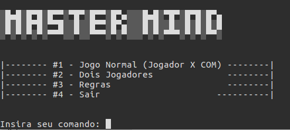
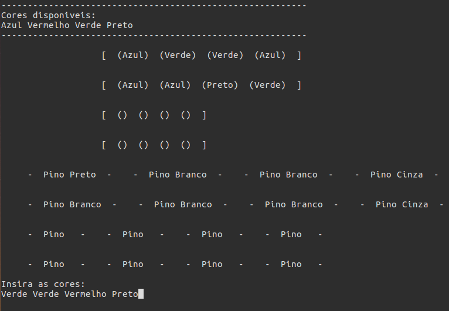
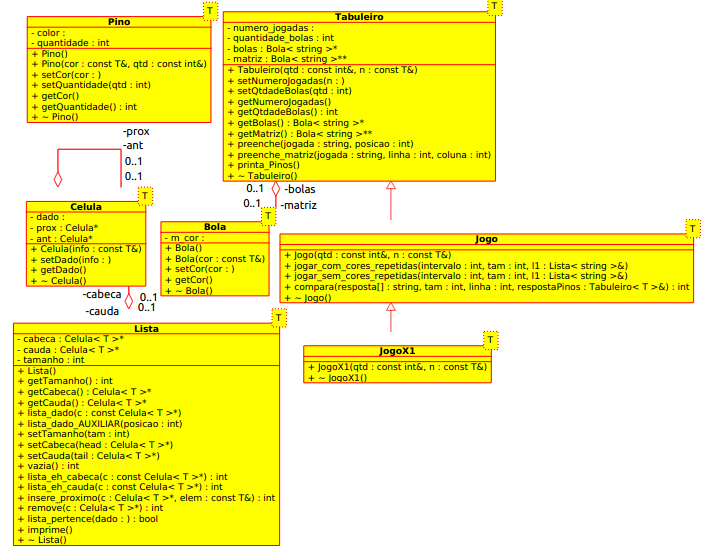

# Mastermind
- C++ course final project 2019.1
- Development of the *Mastermind* game in C++, using concepts such as OOP, composition, inheritance, polymorphism, operator overloading, etc
- Guilherme Araujo Machado do Nascimento and Gustavo Henrique Oliveira de Paula



## Installation
1. Run

```
make && ./mastermind
```

2. Use the corresponding number to navigate on the menu

3. In case of any doubts, check the *Rules* section in the menu



## UML
- UML Class diagram of the project:



## Extra
- Install *Toilet* package to use personalized theme, run:

```
$ sudo apt install toilet
```